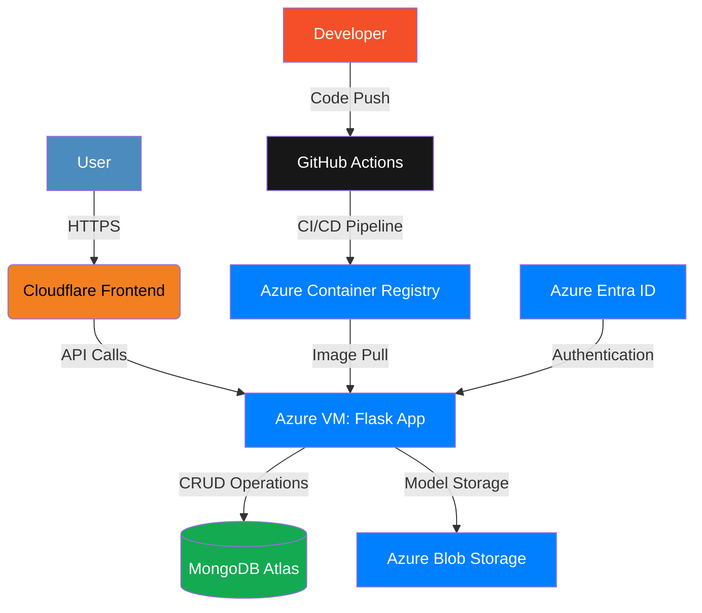
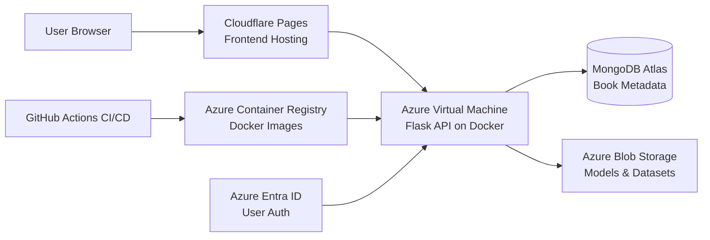
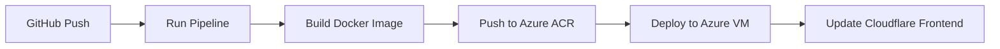

# Book Recommendation System for International Remote Jobs 🚀

  


## 🌟 Overview
A production-grade MLOps platform that recommends books for landing international remote jobs. Features include:
- Top 100 books displayed on landing page
- Interactive book exploration with recursive recommendations
- Enterprise-grade MLOps pipeline built from scratch
- End-to-end CI/CD automation with GitHub Actions
- Cloud-native architecture on Azure and Cloudflare

[](https://shelf-genie.pages.dev/)
[]()

## 🎥 Demo Video
https://github.com/user-attachments/assets/1b29db95-847f-4a57-a245-cc7f741eed8a 


## ✨ Features
### Core Functionality
- **Recursive Recommendations**: Click any book → view details + 20 similar books → repeat endlessly
- **Modern UI**: Clean animations and responsive design
- **Personalized Suggestions**: ML-powered recommendation engine

### MLOps Pipeline
| Component          | Technology          | Description                     |
|--------------------|---------------------|---------------------------------|
| **Data Ingestion** | Custom Python       | Raw data collection             |
| **Validation**     | Custom Rules Engine | Data quality checks             |
| **Transformation** | Pandas/Numpy        | Feature engineering             |
| **Model Training** | Scikit-Learn        | Custom similarity algorithm     |
| **Model Serving**  | Flask + Docker      | REST API endpoint               |
| **Monitoring**     | Custom Logging      | Performance tracking            |

### ☁️ Infrastructure Architecture


**End-to-End Cloud Implementation with Azure Services:**



**Data Flow:**
1. User accesses Cloudflare-hosted frontend
2. Frontend makes API calls to Flask app on Azure VM (Port 5000)
3. Flask app retrieves:
   - Book metadata from MongoDB
   - ML models from Blob Storage
   - User credentials via Entra ID
4. Recommendation engine processes similarity matrix
5. Results returned through API to frontend

**Security Components:**
- 🔒 Azure Entra ID for authentication
- 🔑 SSH Key access to Azure VM
- 🔐 Secrets management via GitHub Secrets
- 🛡️ Cloudflare DDoS protection
- 🔍 Port filtering (22, 80, 5000 only)

**Network Configuration:**
```bash
az vm open-port \
    --resource-group myResourceGroup \
    --name myVM \
    --port 5000 \
    --priority 1001
```

## 🛠️ Technologies
**Backend**
```plaintext
Python · Flask · MongoDB · Docker · Azure ML
```
**Frontend**
```plaintext
HTML · CSS · JavaScript · Cloudflare
```
**DevOps**
```plaintext
GitHub Actions · Azure ACR · Azure VM · Azure Blob Storage
```

## 🚀 Installation
### Prerequisites
- Python 3.13+
- Docker
- MongoDB Atlas account
- Azure account

### Local Setup
```bash
# Clone repository
git clone https://github.com/CodeWithTaskin/Shelf-Genie.git
cd Shelf-Genie

# Install dependencies
pip install -r requirements.txt

# Set environment variables
export MONGODB_URL="your_mongodb_connection_string"
export AZURE_STORAGE_CONNECTION_STRING="your_azure_connection_string"

# Run Flask backend
python app.py

# Launch frontend
index.html
```

## 🔧 Deployment
### CI/CD Pipeline


### Infrastructure Setup
1. **Azure Configuration**
   - Create Blob Storage container
   - Set up Azure VM with Docker runtime
   - Configure Azure ACR repository

2. **Security Setup**
   ```bash
   # Create Entra ID service principal
   az ad sp create-for-rbac --name "book-recommender"
   
   # Configure VM access
   az vm user update --resource-group myResourceGroup \
   --name myVM --username azureuser --ssh-key-value ~/.ssh/id_rsa.pub
   ```

3. **GitHub Secrets**
   ```plaintext
   ACR_LOGIN_SERVER    = <your_acr_login_server>
   ACR_USERNAME        = <service_principal_appid>
   ACR_PASSWORD        = <service_principal_password>
   AZURE_STORAGE_CONNECTION_STRING = <connection_string>
   MONGODB_URL         = <mongodb_connection_string>
   ```

## 📂 Project Structure
```bash
├── .github/workflows       # CI/CD pipelines
├── src/components          # ETL components
│   ├── ingestion.py
│   ├── validation.py
│   └── transformation.py
├── model                   # ML components
│   ├── training.py
│   └── pusher.py
├── app                     # Flask backend
│   ├── main.py             # API endpoints
│   └── Dockerfile          # Multi-stage build
├── frontend                # React application
│   ├── public
│   └── src
│       ├── components      # UI components
│       └── services        # API integration
└── infrastructure          # Deployment scripts
    ├── azure-deploy.sh
    └── cloudflare-setup.md
```

## 🔐 Environment Variables
| Variable                          | Description                     | Required |
|-----------------------------------|---------------------------------|----------|
| `MONGODB_URL`                     | MongoDB connection string       | Yes      |
| `AZURE_STORAGE_CONNECTION_STRING` | Azure Blob Storage connection   | Yes      |
| `ACR_LOGIN_SERVER`                | Azure Container Registry URL    | Prod     |
| `FLASK_ENV`                       | Development/production mode     | No       |

## 🔄 CI/CD Workflow
```yaml
name: Shelf-Genie Deployment on Azure

on:
  push:
    branches: [ "main" ]
  pull_request:
    branches: [ "main" ]

jobs:
  Build-and-Push-on-ACR:
    runs-on: ubuntu-latest

    steps:
      - uses: actions/checkout@v4

      - name: Login to Azure Container Registry
        uses: azure/docker-login@v1
        with:
          login-server: ${{ secrets.ACR_LOGIN_SERVER }}
          username: ${{ secrets.ACR_USERNAME }}
          password: ${{ secrets.ACR_PASSWORD }}

      - name: Install Requirements
        run: |
          pip install --upgrade pip && pip install --no-cache-dir -r requirements.txt

      - name: Run Pipeline
        run: python demo.py
        env:
          MONGODB_URL: ${{ secrets.MONGODB_URL }}
          AZURE_STORAGE_CONNECTION_STRING: ${{ secrets.AZURE_STORAGE_CONNECTION_STRING }}

      - name: Build and Push Docker Image on ACR
        run: |
          docker build -t ${{ secrets.ACR_LOGIN_SERVER }}/recommendation-system-api .
          docker push ${{ secrets.ACR_LOGIN_SERVER }}/recommendation-system-api

  Deploy-on-Azure:
    needs: Build-and-Push-on-ACR
    runs-on: self-hosted  # This runs directly on the Azure VM
    env:
      AZURE_STORAGE_CONNECTION_STRING: ${{ secrets.AZURE_STORAGE_CONNECTION_STRING }}

    steps:
      - name: Login to Azure Container Registry on VM
        run: |
          echo "${{ secrets.ACR_PASSWORD }}" | docker login ${{ secrets.ACR_LOGIN_SERVER }} -u ${{ secrets.ACR_USERNAME }} --password-stdin

      - name: Stop and Remove Existing Container
        run: |
          if [ "$(docker ps -q -f name=shelfgenie-api)" ]; then
            echo "Stopping and removing existing container"
            docker stop shelfgenie-api
            docker rm shelfgenie-api
          fi

      - name: Pull and Run New Container
        run: |
          docker pull ${{ secrets.ACR_LOGIN_SERVER }}/recommendation-system-api
          docker run -d --name shelfgenie-api -p 5000:5000 -e AZURE_STORAGE_CONNECTION_STRING="${{ secrets.AZURE_STORAGE_CONNECTION_STRING }}" ${{ secrets.ACR_LOGIN_SERVER }}/recommendation-system-api


```

## 📄 License
Distributed under the LGPL License. See `LICENSE` for more information.
