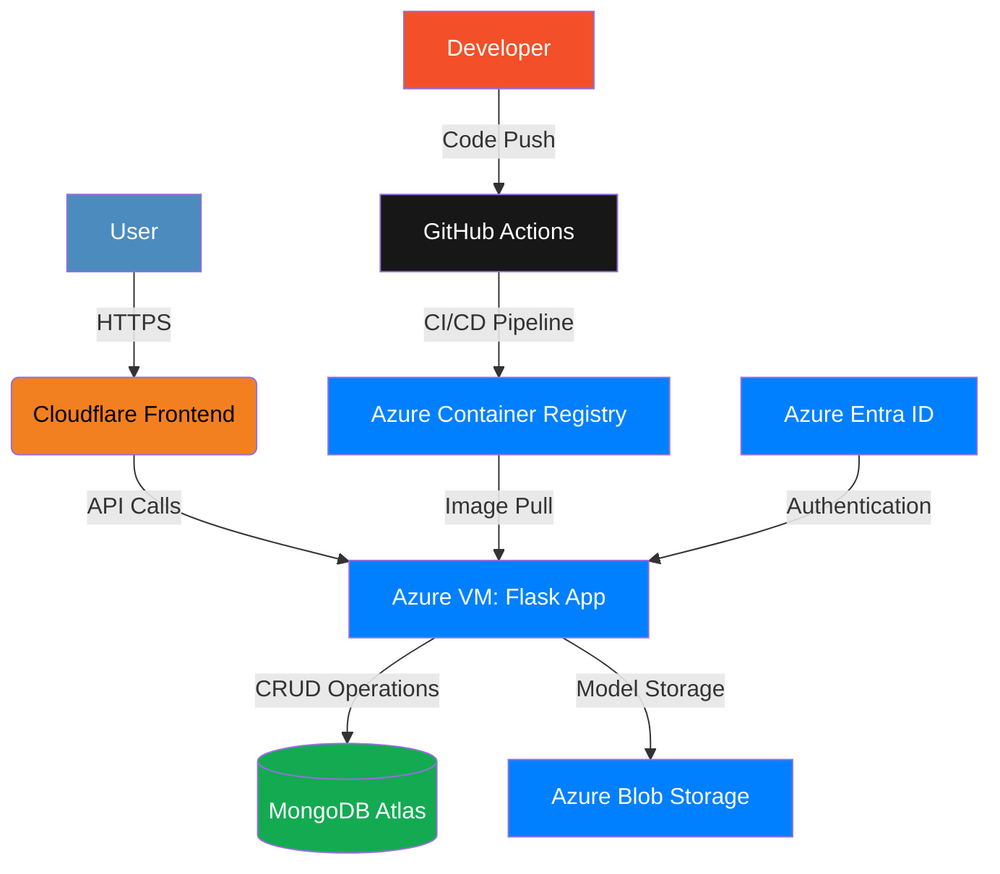
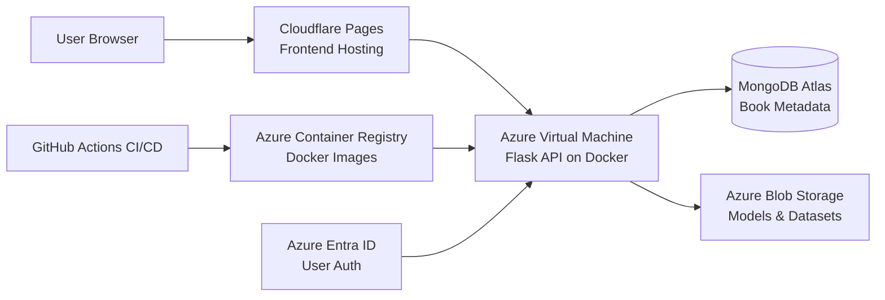
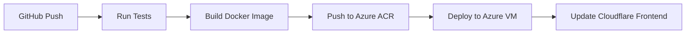

# Book Recommendation System for International Remote Jobs 🚀

  


## 🌟 Overview
A production-grade MLOps platform that recommends books for landing international remote jobs. Features include:
- Top 100 books displayed on landing page
- Interactive book exploration with recursive recommendations
- Enterprise-grade MLOps pipeline built from scratch
- End-to-end CI/CD automation with GitHub Actions
- Cloud-native architecture on Azure and Cloudflare

[](https://your-demo-link.com)
[](https://your-api-link.com)

## 🎥 Demo Video
[](https://your-video-link.com)  


## ✨ Features
### Core Functionality
- **Recursive Recommendations**: Click any book → view details + 20 similar books → repeat endlessly
- **Modern UI**: Clean animations and responsive design
- **Personalized Suggestions**: ML-powered recommendation engine

### MLOps Pipeline
| Component          | Technology          | Description                     |
|--------------------|---------------------|---------------------------------|
| **Data Ingestion** | Custom Python       | Raw data collection             |
| **Validation**     | Custom Rules Engine | Data quality checks             |
| **Transformation** | Pandas/Numpy        | Feature engineering             |
| **Model Training** | Scikit-Learn        | Custom similarity algorithm     |
| **Model Serving**  | Flask + Docker      | REST API endpoint               |
| **Monitoring**     | Custom Logging      | Performance tracking            |

### ☁️ Infrastructure Architecture


**End-to-End Cloud Implementation with Azure Services:**



**Data Flow:**
1. User accesses Cloudflare-hosted frontend
2. Frontend makes API calls to Flask app on Azure VM (Port 5000)
3. Flask app retrieves:
   - Book metadata from MongoDB
   - ML models from Blob Storage
   - User credentials via Entra ID
4. Recommendation engine processes similarity matrix
5. Results returned through API to frontend

**Security Components:**
- 🔒 Azure Entra ID for authentication
- 🔑 SSH Key access to Azure VM
- 🔐 Secrets management via GitHub Secrets
- 🛡️ Cloudflare DDoS protection
- 🔍 Port filtering (22, 80, 5000 only)

**Network Configuration:**
```bash
az vm open-port \
    --resource-group myResourceGroup \
    --name myVM \
    --port 5000 \
    --priority 1001
```

## 🛠️ Technologies
**Backend**
```plaintext
Python · Flask · MongoDB · Docker · Azure ML
```
**Frontend**
```plaintext
React · Tailwind CSS · Framer Motion · Cloudflare
```
**DevOps**
```plaintext
GitHub Actions · Azure ACR · Azure VM · Azure Blob Storage
```

## 🚀 Installation
### Prerequisites
- Python 3.13+
- Docker
- MongoDB Atlas account
- Azure account

### Local Setup
```bash
# Clone repository
git clone https://github.com/yourusername/book-recommendation-system.git
cd book-recommendation-system

# Install dependencies
pip install -r requirements.txt

# Set environment variables
export MONGODB_URL="your_mongodb_connection_string"
export AZURE_STORAGE_CONNECTION_STRING="your_azure_connection_string"

# Run Flask backend
python app/main.py

# Launch frontend
cd frontend
npm install
npm start
```

## 🔧 Deployment
### CI/CD Pipeline


### Infrastructure Setup
1. **Azure Configuration**
   - Create Blob Storage container
   - Set up Azure VM with Docker runtime
   - Configure Azure ACR repository

2. **Security Setup**
   ```bash
   # Create Entra ID service principal
   az ad sp create-for-rbac --name "book-recommender"
   
   # Configure VM access
   az vm user update --resource-group myResourceGroup \
   --name myVM --username azureuser --ssh-key-value ~/.ssh/id_rsa.pub
   ```

3. **GitHub Secrets**
   ```plaintext
   ACR_LOGIN_SERVER    = <your_acr_login_server>
   ACR_USERNAME        = <service_principal_appid>
   ACR_PASSWORD        = <service_principal_password>
   AZURE_STORAGE_CONNECTION_STRING = <connection_string>
   MONGODB_URL         = <mongodb_connection_string>
   ```

## 📂 Project Structure
```bash
├── .github/workflows       # CI/CD pipelines
├── data_pipeline           # ETL components
│   ├── ingestion.py
│   ├── validation.py
│   └── transformation.py
├── model                   # ML components
│   ├── training.py
│   └── pusher.py
├── app                     # Flask backend
│   ├── main.py             # API endpoints
│   └── Dockerfile          # Multi-stage build
├── frontend                # React application
│   ├── public
│   └── src
│       ├── components      # UI components
│       └── services        # API integration
└── infrastructure          # Deployment scripts
    ├── azure-deploy.sh
    └── cloudflare-setup.md
```

## 🔐 Environment Variables
| Variable                          | Description                     | Required |
|-----------------------------------|---------------------------------|----------|
| `MONGODB_URL`                     | MongoDB connection string       | Yes      |
| `AZURE_STORAGE_CONNECTION_STRING` | Azure Blob Storage connection   | Yes      |
| `ACR_LOGIN_SERVER`                | Azure Container Registry URL    | Prod     |
| `FLASK_ENV`                       | Development/production mode     | No       |

## 🔄 CI/CD Workflow
```yaml
name: Production Deployment

on:
  push:
    branches: [ main ]

jobs:
  build-deploy:
    runs-on: ubuntu-latest
    steps:
    - name: Checkout code
      uses: actions/checkout@v3

    - name: Build Docker image
      run: docker build -t book-recommender:${{ github.sha }} .

    - name: Push to Azure ACR
      run: |
        docker login ${{ secrets.ACR_LOGIN_SERVER }} \
          -u ${{ secrets.ACR_USERNAME }} \
          -p ${{ secrets.ACR_PASSWORD }}
        docker push ${{ secrets.ACR_LOGIN_SERVER }}/book-recommender:${{ github.sha }}

    - name: Deploy to Azure VM
      uses: appleboy/ssh-action@master
      with:
        host: ${{ secrets.AZURE_VM_IP }}
        username: azureuser
        key: ${{ secrets.AZURE_SSH_KEY }}
        script: |
          docker pull ${{ secrets.ACR_LOGIN_SERVER }}/book-recommender:${{ github.sha }}
          docker stop book-app || true
          docker run -d --rm -p 5000:5000 \
            -e MONGODB_URL=$MONGODB_URL \
            -e AZURE_STORAGE_CONNECTION_STRING=$AZURE_STORAGE_CONNECTION_STRING \
            --name book-app ${{ secrets.ACR_LOGIN_SERVER }}/book-recommender:${{ github.sha }}
```

## 📄 License
Distributed under the MIT License. See `LICENSE` for more information.

## 📧 Contact
[Your Name] - [your.email@example.com]  
Project Link: [https://github.com/yourusername/book-recommendation-system](https://github.com/yourusername/book-recommendation-system)


### ☁️ Infrastructure Architecture
**End-to-End Cloud Implementation with Azure Services:**


**Data Flow:**
1. User accesses Cloudflare-hosted frontend
2. Frontend makes API calls to Flask app on Azure VM (Port 5000)
3. Flask app retrieves:
   - Book metadata from MongoDB
   - ML models from Blob Storage
   - User credentials via Entra ID
4. Recommendation engine processes similarity matrix
5. Results returned through API to frontend

**Security Components:**
- 🔒 Azure Entra ID for authentication
- 🔑 SSH Key access to Azure VM
- 🔐 Secrets management via GitHub Secrets
- 🛡️ Cloudflare DDoS protection
- 🔍 Port filtering (22, 80, 5000 only)

**Network Configuration:**
```bash
az vm open-port \
    --resource-group myResourceGroup \
    --name myVM \
    --port 5000 \
    --priority 1001
```

## Suggested Improvements
1. Add **Azure Application Gateway** for SSL termination and WAF protection
2. Implement **Azure Monitor** for performance tracking
3. Use **Azure Key Vault** for secret management
4. Add **Redis Cache** on Azure for API response caching
5. Implement **Load Balancer** for horizontal scaling

## Cost Optimization Tips
- Use **Azure Spot VMs** for development environments
- Enable **Blob Storage Tiering** (Hot/Cool/Archive)
- Configure **Auto-shutdown** for non-production VMs
- Use **MongoDB Atlas M0** free tier for development

Would you like me to provide:
1. Detailed security configuration guide for Azure Entra ID
2. Sample Azure CLI commands for infrastructure setup
3. Cost estimation breakdown for the architecture
4. Alternative architecture using Azure Kubernetes Service (AKS)?

